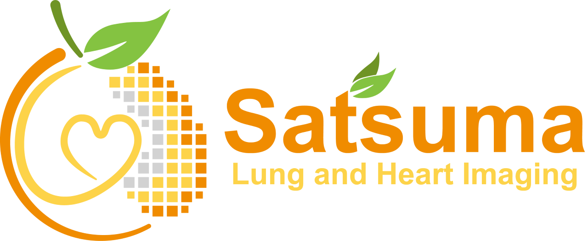

.. PinTheOrgan documentation master file, created by
   sphinx-quickstart on Tue Oct 18 11:23:32 2022.
   You can adapt this file completely to your liking, but it should at least
   contain the root `toctree` directive.

|
Welcome to PinTheOrgan!
=======================

This is a non-commercial educational game aimed at teaching about organs,
where they are and somewhat their relative size. It uses organ cutouts by `adventure-in-a-box <https://www.adventure-in-a-box.com>`_.
It was originally delivered as an educational activity stall at the BREATHE `Bloomsbury Festival <https://bloomsburyfestival.org.uk/>`_ 2022, delivered by the `Satsuma Lab <https://satsuma.cs.ucl.ac.uk>`_, part of the `Centre for Medical Image Computing (CMIC) <https://www.ucl.ac.uk/medical-image-computing/>`_ from `University College London (UCL) <https://www.ucl.ac.uk>`_.

This documentation explains how to run the game, see :doc:`activity` and if you don't have the cutouts ready to :doc:`setup` the game.

.. image:: imgs/all_organs.jpg
  :width: 600
  :alt: All organs.

.. todo:
  * Add an image here of the Activity
  * Add Satsuma logo

.. toctree::
   :maxdepth: 2
   :caption: Contents:

   setup
   activity
   solution

Indices and tables
==================

* :ref:`genindex`
* :ref:`modindex`
* :ref:`search`
